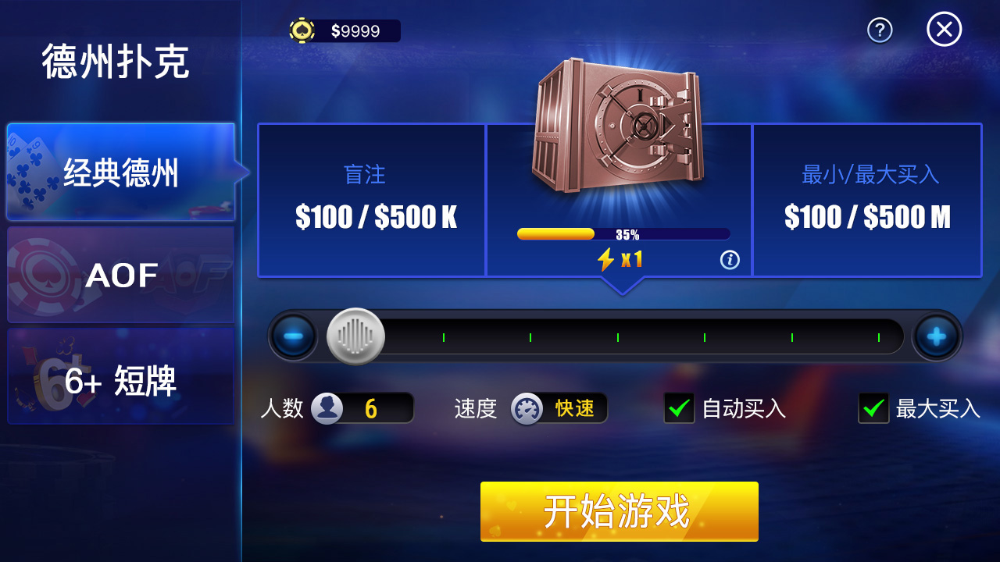
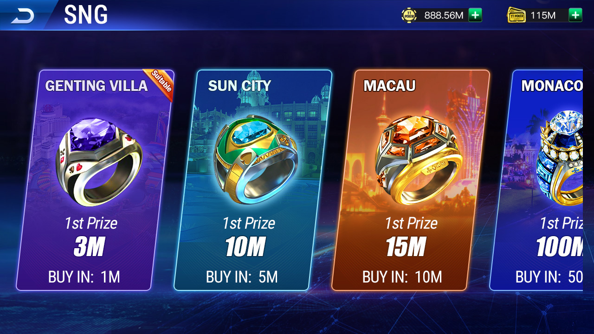
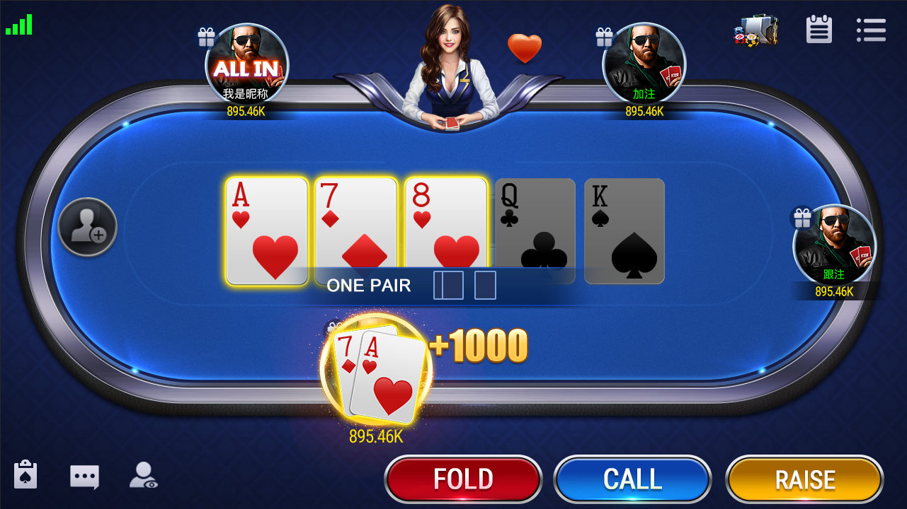
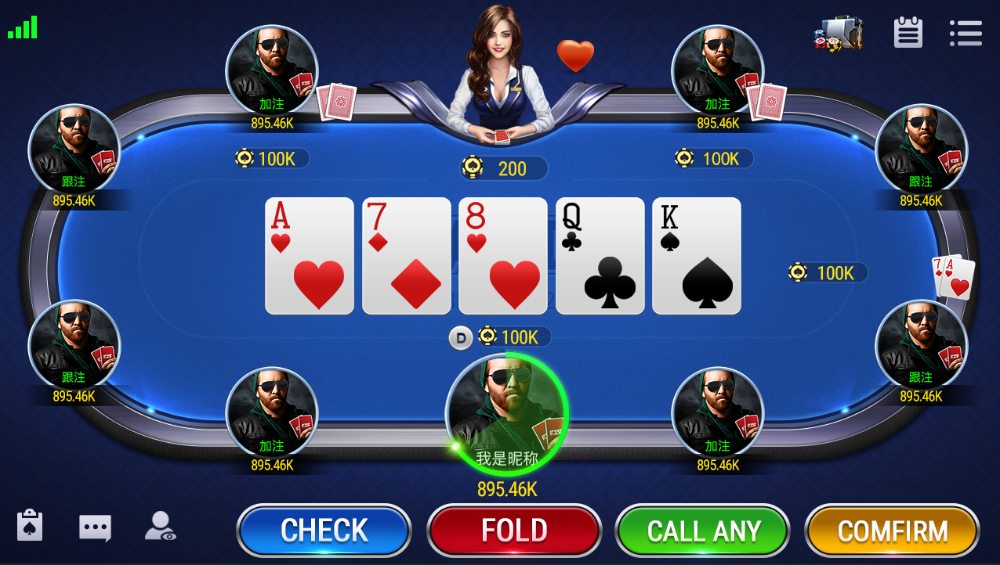

[简体中文](README.md) | [繁體中文](README.zh-TW.md) | [English](README.en.md)

# Texas Holdem Poker Source Code: Lobby, MTT/SNG and C++ Table Service

This project presents a cross-platform **Texas Holdem poker source code** collection with authentic screens for a poker lobby, classic Hold'em, AOF, short-deck entry, MTT, SNG, events and table actions. Public code provides verifiable C++ player/table state, blinds, bet pools, community cards, insurance, hand history, timers, Tars GM services, MySQL configuration and Unity/Lua utility assets.

> The public repository requires external protocols, frameworks, services, configuration and assets for a complete build. Verify final scope against the actual delivery and test results.

## Product capabilities

- Multi-mode lobby with classic Hold'em, AOF, 6+ short deck, ranked play, private-room and tournament entry points.
- Table journey from buy-in and seating through preflop, flop, turn, river and showdown.
- Player actions including check, bet, call, raise and fold.
- MTT and SNG discovery, registration, blind progression and ranking workflows.
- C++ context for users, seats, blinds, hole/community cards, pots, game history and settlement data.

## Authentic screenshots

| Lobby and rooms | Tournaments and table |
|---|---|
|  |  |
|  |  |
|  |  |
|  | |

## Technical structure

- C++ game context for players, seats, blinds, cards, pots and hand histories.
- Begin/end timers and operation-time broadcasts.
- Game server, GMServer and Tars servant interfaces.
- MySQL operations and tournament configuration records.
- Unity prefabs and Lua utilities for networking, resources, audio, cards and clubs.

The Makefile references external Tars/XGame modules. Complete the dependency graph and test side pots, all-ins, reconnects, hand evaluation, settlement and tournament transitions before deployment.

## Contact

- Telegram: [@xuzongbin001](https://t.me/xuzongbin001)
- Email: [masterai918@gmail.com](mailto:masterai918@gmail.com)

Specify the client, server, database, tournament or deployment scope you need to verify.

